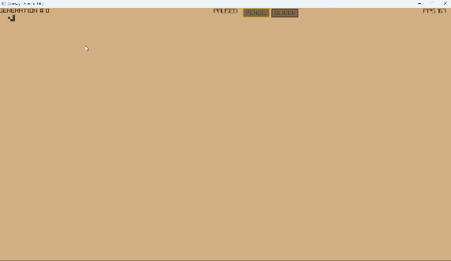

# practice-game-of-life-odin

Conway's Game of Life implementation in Odin lang.

Simple parallilization is used to speed up cell's next generation status calculation.

Build: `odin build main.odin -out:gol.exe -o:aggressive -file`

If you do not have Odin lang compiler -> use "gol.exe".

Checked on Windows 11 only (made with "dev-2024-03:d325c8ad2" version).

